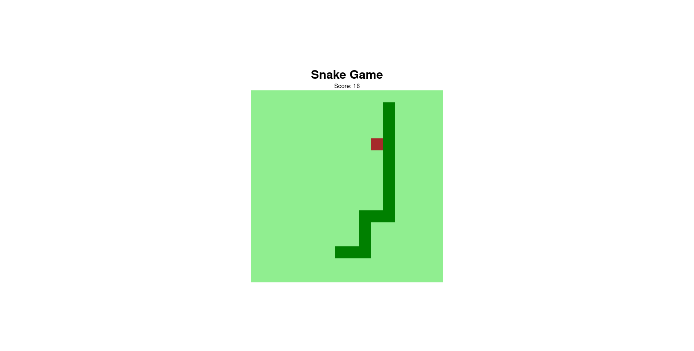

<h1 align="center" id="title">Snake Game</h1>

<p align="center">The classic Snake game made with JavaScript</p>

<br>

## Table of contents
<!--ts-->
   * [Overview](#overview)
   * [Technologies](#technologies)
   * [Getting the project](#getting-the-project)
   * [Viewing the Project](#viewing-the-project)
   * [Improvements and Suggested Ideas](#improvements-and-suggested-ideas)
   * [Author](#author)
<!--te-->

## Overview

Being inspired by the project [Recreating the snake game with JavaScript](https://web.digitalinnovation.one/lab/recriando-o-jogo-da-cobrinha-com-javascript/learning/a41588bb-45b0-41ce-a7d3-20012199fb11) from Bootcamp [HTML Web Developer](https://web.digitalinnovation.one/track/html-web-developer) of the platform [Digital Innovation One](https://digitalinnovation.one/), this project aims to practice CSS Flexbox.

A refactoring was carried out in the project's javascript, where some concepts were applied to make it more current.

Go to the [top](#title).

## Technologies
The following technologies were used in the construction of the project:

- [HTML](https://developer.mozilla.org/pt-BR/docs/Web/HTML)
- [CSS](https://developer.mozilla.org/pt-BR/docs/Web/CSS)
- [JavaScript](https://developer.mozilla.org/pt-BR/docs/Web/JavaScript)

Go to the [top](#title).

## Getting the project

Open a command terminal in the folder where you want to save the project and type the command below:

```git
$ git clone https://github.com/jmontejr/snake-game.git
```

Or download the compressed file directly from the project repository on Github and unzip wherever you want.

Go to the [top](#title).

## Viewing the Project

To view the project, simply access the [link](https://jmontejr.github.io/light-dark-mode) or once the project repository is cloned, go to the folder where the project is located and open the `index.html` file in your usual browser.

### 01- Game Screen
<p align="center">
    
</p>

Go to the [top](#title).


## Improvements and Suggested Ideas

### Improvements made:
- Adding the food score;
### Suggested Ideas:
- Adding the game reset option;
- Adding speed difficulty level based on score;
- Responsive Layout;
- New refactoring, separating concepts and responsibilities from methods and objects, applying SOLID concepts as an example.


Go to the [top](#title).

## Author

<h2>José Monte</h2>
<p>Development with :heart:</p>
<div>
    <a href="https://jmontejr.github.io">
        
    </a>
    <space></space>
    <a href="https://www.linkedin.com/in/jmontejr">
        
    </a>
    <space></space>
    <a href="https://codepen.io/jmontejr">
        
    </a>
</div>

Go to the [top](#title).
